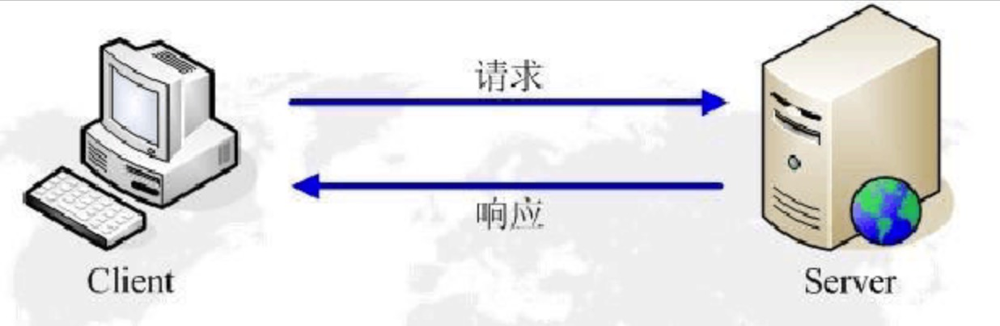

# 一、AJAX 概述

Ajax 即 “*Asynchronous  Javascript And XML*”（异步 JavaScript 和 XML），是指一种创建交互式[网页](https://baike.baidu.com/item/网页/99347)应用的网页开发技术。

Ajax = 异步 [JavaScript](https://baike.baidu.com/item/JavaScript) 和 XML 。

Ajax 是一种用于创建快速动态网页的技术。

Ajax 是一种在无需重新加载整个网页的情况下，能够更新部分网页的技术 => 局部刷新。

通过在后台与服务器进行少量数据交换，Ajax 可以使网页实现异步更新。这意味着可以在不重新加载整个网页的情况下，对网页的某部分进行更新。

传统的网页（不使用 Ajax）如果需要更新内容，必须重载整个网页页面。

# 二、相关知识点 *

## 1、进程 & 线程

进程：每一个应用程序就是一个进程

线程：每个进程里面包含多个线程

## 2、同步 & 异步

- 同步：主线程执行客户端发起请求->服务器响应->页面加载，阻塞线程。
- 异步：后台执行客户端发起请求->服务器响应->页面加载，同时执行。

## 3、GET & POST

- GET：一般用于信息获取，请求参数拼接在地址后，不安全，速度快。
- POST：一般用于修改服务器上的资源，请求参数打包在请求报文中，安全，速度慢。

## 4、HTTP 

### 4.1. 概述

HTTP(HyperText Transfer Protocol)是一套计算机通过网络进行通信的规则。计算机专家设计出HTTP，使HTTP客户（如Web浏览器）能够从HTTP服务器(Web服务器)请求信息和服务，HTTP目前协议的版本是1.1。HTTP是一种无状态的协议，无状态是指Web浏览器和Web服务器之间不需要建立持久的连接，这意味着当一个客户端向服务器端发出请求，然后Web服务器返回响应(response)，连接就被关闭了，在服务器端不保留连接的有关信息。HTTP遵循请求(Request)/应答(Response)模型。Web浏览器向Web服务器发送请求，Web服务器处理请求并返回适当的应答。所有HTTP连接都被构造成一套请求和应答。



HTTP通信机制是在一次完整的HTTP通信过程中，Web浏览器与Web服务器之间将完成下列7个步骤：

（1）    建立TCP连接

在HTTP工作开始之前，Web浏览器首先要通过网络与Web服务器建立连接，该连接是通过TCP来完成的，该协议与IP协议共同构建Internet，即著名的TCP/IP协议族，因此Internet又被称作是TCP/IP网络。HTTP是比TCP更高层次的应用层协议，根据规则，只有低层协议建立之后才能进行更深层协议的连接，因此，首先要建立TCP连接，一般TCP连接的端口号是80。

（2）    Web浏览器向Web服务器发送请求命令

一旦建立了TCP连接，Web浏览器就会向Web服务器发送请求命令

例如：GET/sample/hello.jsp HTTP/1.1

（3）    Web浏览器发送请求头信息

浏览器发送其请求命令之后，还要以头信息的形式向Web服务器发送一些别的信息，之后浏览器发送了一空白行来通知服务器，它已经结束了该头信息的发送。

（4）    Web服务器应答

客户机向服务器发出请求后，服务器会客户机回送应答，

HTTP/1.1 200 OK

应答的第一部分是协议的版本号和应答状态码

（5）    Web服务器发送应答头信息

正如客户端会随同请求发送关于自身的信息一样，服务器也会随同应答向用户发送关于它自己的数据及被请求的文档。

（6）    Web服务器向浏览器发送数据

Web服务器向浏览器发送头信息后，它会发送一个空白行来表示头信息的发送到此为结束，接着，它就以Content-Type应答头信息所描述的格式发送用户所请求的实际数据

（7）    Web服务器关闭TCP连接

一般情况下，一旦Web服务器向浏览器发送了请求数据，它就要关闭TCP连接，然后如果浏览器或者服务器在其头信息加入了这行代码：

Connection:keep-alive

TCP连接在发送后将仍然保持打开状态，于是，浏览器可以继续通过相同的连接发送请求。保持连接节省了为每个请求建立新连接所需的时间，还节约了网络带宽。

### 4.2. 请求格式

_请求行：请求方法 URI 协议/版本 

_请求头（request header）

_请求正文

### 4.3. 响应格式

_状态行

_响应头

_响应正文

### 4.4. 状态码

状态码由三位数字组成，第一位数字表示响应的类型，常用的状态码有五大类如下所示：

1xx：表示服务器已接收了客户端请求，客户端可继续发送请求;

2xx：表示服务器已成功接收到请求并进行处理;

3xx：表示服务器要求客户端重定向;

4xx：表示客户端的请求有非法内容;

5xx：表示服务器未能正常处理客户端的请求而出现意外错误;

状态码描述文本有如下取值：

200 OK：表示客户端请求成功;

400 Bad Request：表示客户端请求有语法错误，不能被服务器所理解;

401 Unauthonzed：表示请求未经授权，该状态代码必须与 WWW-Authenticate 报头域一起使用;

403 Forbidden：表示服务器收到请求，但是拒绝提供服务，通常会在响应正文中给出不提供服务的原因;

404 Not Found：请求的资源不存在，例如，输入了错误的URL;

500 Internal Server Error：表示服务器发生不可预期的错误，导致无法完成客户端的请求;

503 Service Unavailable：表示服务器当前不能够处理客户端的请求，在一段时间之后，服务器可能会恢复正常;

# 三、数据传输格式

## 1、XML 

XML 指可扩展标记语言

XML 被设计用来传输和存储数据

其语法形式与HTML类似，如下所示：

```xml
<?xml version="1.0" encoding="UTF-8" ?>
<root>
    <name>木子李</name>
    <age>28</age>
    <profession>Web前端工程师/iOS工程师</profession>
    <address>四川省成都市高新区广都龙湖九里晴川</address>
</root>
```

## 2、JSON

### 2.1. 概念

- JSON：JavaScript 对象表示法（JavaScript Object Notation）
- JSON 是存储和交换文本的语法，类似XML。它采用键值对的方式来组织，易于人们阅读和编写，同时也易于机器解析和生成。
- JSON是独立于语言的，也就是说不管什么语言，都可以解析JSON，只需要按照JSON的规则来就行。

### 2.2. JSON 与 XML 比较

- json的长度和xml格式比起来很短小
- json读写的速度更快
- json可以使用JavaScript內建的方法直接进行解析，转换成JavaScript对象非常方便

### 2.3. 方法

- 转换：`JSON.stringify(obj)`
- 解析：`JSON.parse(jsonObj)`

### 2.4. 校验工具

https://jsonlint.com/


