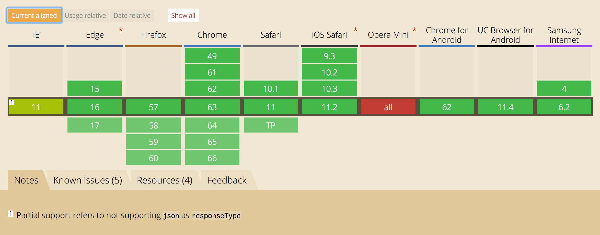
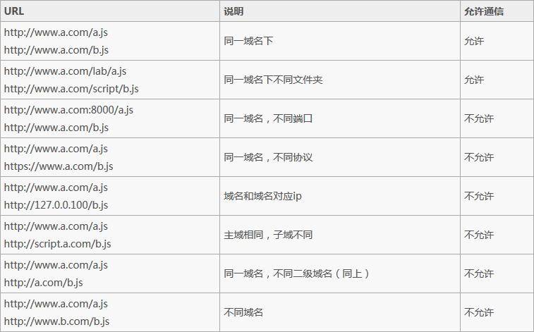

# # AJAX 概述

AJAX(Asynchronous Javascript And XML)

- Asynchronous：浏览器支持异步通信模式，实现页面局部刷新。
- JavaScript：使用的编程语言
- And
- XML：通信数据的承载方式，但实际很少使用XML格式

> 相关技术：JavaScript、XML（JSON）、DOM操作

# # 相关知识点

## 1、同步异步

- 同步：主线程执行，客户端发起请求->服务器响应->页面加载，阻塞线程。
- 异步：后台执行，客户端发起请求->服务器响应->页面加载同时执行。

## 2、GET & POST

- GET：一般用于信息获取，请求参数拼接在地址后，不安全，速度快。
- POST：一般用于修改服务器上的资源，请求参数打包在请求报文中，安全，速度慢。

## 3、HTTP请求

http 是计算机通过网络进行通信的规则，http是一种无状态协议。

> 一个完整的http请求，通常有下面7个步骤：

1）、建立TCP连接

2）、Web浏览器向Web服务器发送请求命令

3）、Web浏览器发送请求头信息

4）、Web服务器应答

5）、Web服务器发送应答头信息

6）、Web服务器向浏览器发送数据

7）、Web服务器关闭TCP连接

> 一个HTTP请求一般由四部分组成：

1）、HTTP请求的方法或动作，比如是GET还是POST请求

2）、URL 请求地址

3）、请求头，包含一些客户端环境信息，身份验证信息等

4）、请求体，也就是请求正文，请求正文中可以包含客户提交的查询字符串信息，表单信息等等。

> 一个HTTP响应一般由三部分组成：

1）、一个数字和文字组成的状态码，用来显示请求是成功还是失败；

2）、响应头，响应头也和请求头一样包含许多有用的信息，例如数据类型、日期时间、内容类型和长度等。

3）、响应体，也就是响应正文

HTTP状态码由3位数字构成，其中首位数字定义了状态码的类型

1）、1XX：信息类，表示收到Web浏览器请求，正在进一步的处理中；

2）、2XX：成功，表示用户请求被正确接收、理解和处理。例如 200 OK；

3）、3XX：重定向，表示请求没有成功，客户必须采取进一步的动作；

4）、4XX：客户端错误，表示客户端提交的请求有错误。例如 404 Not Found：请求中引用的文档不存在；

5）、5XX：服务器错误，表示服务器不能完成对请求的处理。例如 500

# # Ajax 与 XMLHttpRequest

我们通常将 `Ajax` 等同于 `XMLHttpRequest`，但细究起来它们两个是属于不同维度的2个概念。

> 以下是我认为对`Ajax`较为准确的解释：（摘自[what is Ajax](http://www.tutorialspoint.com/ajax/what_is_ajax.htm)）
> AJAX stands for Asynchronous JavaScript and XML. AJAX is a new technique for creating better, faster, and more interactive web applications with the help of XML, HTML, CSS, and Java Script.
>
> AJAX is based on the following open standards:
>
> - Browser-based presentation using HTML and Cascading Style Sheets (CSS).
> - Data is stored in XML format and fetched from the server.
> - Behind-the-scenes data fetches using XMLHttpRequest objects in the browser.
> - JavaScript to make everything happen.

从上面的解释中可以知道：`ajax`是一种技术方案，但并不是一种**新技术**。它依赖的是现有的`CSS`/`HTML`/`Javascript`，而其中最核心的依赖是浏览器提供的`XMLHttpRequest`对象，是这个对象使得浏览器可以发出`HTTP`请求与接收`HTTP`响应。

所以我用一句话来总结两者的关系：我们使用`XMLHttpRequest`对象来发送一个`Ajax`请求。

# # XMLHttpRequest 的发展历程

XMLHttpRequest 一开始只是微软浏览器提供的一个接口，后来各大浏览器纷纷效仿也提供了这个接口，再后来W3C对它进行了标准化，提出了[XMLHttpRequest标准](https://www.w3.org/TR/XMLHttpRequest/)。XMLHttpRequest 标准又分为`Level 1`和`Level 2`。

> `XMLHttpRequest Level 1` 主要存在以下缺点：

- 受同源策略的限制，不能发送跨域请求；
- 不能发送二进制文件（如图片、视频、音频等），只能发送纯文本数据；
- 在发送和获取数据的过程中，无法实时获取进度信息，只能判断是否完成；

> `XMLHttpRequest Level 2` 是对 `Level 1` 的改进，新增了以下功能：

- 可以发送跨域请求，在服务端允许的情况下；
- 支持发送和接收二进制数据；
- 新增formData对象，支持发送表单数据；
- 发送和获取数据时，可以获取进度信息；
- 可以设置请求的超时时间；

当然更详细的对比介绍，可以参考 [阮一封老师的这篇文章](http://www.ruanyifeng.com/blog/2012/09/xmlhttprequest_level_2.html)，文章中对新增的功能都有具体代码示例。

# # XMLHttpRequest 兼容性

关于`xhr`的浏览器兼容性，大家可以直接查看“[Can I use](http://www.caniuse.com/)”这个网站提供的结果[XMLHttpRequest兼容性](http://caniuse.com/#search=XMLHttpRequest)，下面提供一个截图。



从图中可以看到：

- IE8/IE9、Opera Mini 完全不支持`xhr`对象
- IE10/IE11部分支持，不支持 `xhr.responseType`为`json`

# # XMLHttpRequest 发起 Ajax 请求

我们先来看一下 XMLHttpRequest 发送 Ajax 请求的简单示例代码。

```javascript
function sendAjax() {
  // 1. 创建xhr对象 
  var xhr = new XMLHttpRequest();
  // 2. 设置xhr请求的超时时间
  xhr.timeout = 3000;
  // 3. 设置响应返回的数据格式
  xhr.responseType = "json";
// 4. 创建一个 GET 请求，采用异步
  xhr.open('GET', 'json/goods.json', true);
  // 5. 注册相关事件回调处理函数
  xhr.onload = function(e) { 
    if(this.status == 200|| this.status == 304){
        alert(this.response);
    }
  };
  xhr.ontimeout = function(e) { ... };
  xhr.onerror = function(e) { ... };
  xhr.upload.onprogress = function(e) { ... };
  
  // 6. 发送数据
  xhr.send(null);
}
```

接下来，我们将以问题的形式详细介绍`xhr`的基本使用。

## 1、如何设置request header?

在发送 Ajax 请求（实质是一个[HTTP](http://www.tutorialspoint.com/http/http_header_fields.htm)请求）时，我们可能需要设置一些请求头部信息，比如 `content-type`、`connection`、`cookie`、`accept-xxx` 等。xhr 提供了`setRequestHeader`来允许我们修改请求 header。

> ```c
> void setRequestHeader(DOMString header, DOMString value);
> ```

注意点：

- 方法的第一个参数 header 大小写不敏感，即可以写成 *content-type* ，也可以写成*Content-Type*，甚至写成*content-Type*;
- *Content-Type* 的默认值与具体发送的数据类型有关
- *setRequestHeader* 必须在*open()*方法之后，*send()* 方法之前调用，否则会抛错；
- *setRequestHeader* 可以调用多次，最终的值不会采用覆盖 `override` 的方式，而是采用追加 `append` 的方式。下面是一个示例代码：

```javascript
var xhr = new XMLHttpRequest();
xhr.open('GET', 'demo.json');
xhr.setRequestHeader('X-Test', 'one');
xhr.setRequestHeader('X-Test', 'two');
// 最终request header中"X-Test"为: one, two
xhr.send();
```

## 2、如何获取response header?

xhr 提供了2个用来获取响应头部的方法：

> `DOMString getAllResponseHeaders();`
>
> `DOMString getResponseHeader(DOMString header);`

前者是获取 response 中的所有header 字段，后者只是获取某个指定 header 字段的值。

你需要注意的是：

[W3C在 xhr 标准中的限制](https://www.w3.org/TR/XMLHttpRequest/) 规定客户端无法获取 response 中的 `Set-Cookie`、`Set-Cookie2` 这2个字段，无论是同域还是跨域请求；

[W3C在 cors 标准中对于跨域请求的限制](https://www.w3.org/TR/cors/#access-control-allow-credentials-response-header) 规定对于跨域请求，客户端允许获取的response header字段只限于 

“`simple response header`”

“`Access-Control-Expose-Headers`” 

> a. *simple response header* 包括的 header 字段有：`Cache-Control`, `Content-Language`, `Content-Type`, `Expires`, `Last-Modified`, `Pragma`;
>
> b. *Access-Control-Expose-Headers*：首先得注意是"*Access-Control-Expose-Headers*"进行**跨域请求**时响应头部中的一个字段，对于同域请求，响应头部是没有这个字段的。这个字段中列举的 header 字段就是服务器允许暴露给客户端访问的字段。

所以 *getAllResponseHeaders()*  只能拿到**限制以外**（即被视为`safe`）的header字段，而不是全部字段；而调用 *getResponseHeader(header)* 方法时，`header` 参数必须是**限制以外**的header字段，否则调用就会报`Refused to get unsafe header` 的错误。

## 3、如何指定 xhr.response 的数据类型?

有些时候我们希望 *xhr.response*  返回的就是我们想要的数据类型。比如：响应返回的数据是纯JSON字符串，但我们期望最终通过 *xhr.response*  拿到的直接就是一个 js 对象，我们该怎么实现呢？我们可以通过 *level 2*  提供的 *xhr.responseType*  属性实现。

`responseType` 可设置的格式如下：

| 值               | `xhr.response` 数据类型 | 说明                       |
| --------------- | ------------------- | ------------------------ |
| `""`            | `String` 字符串        | 默认值(在不设置`responseType`时) |
| `"text"`        | `String` 字符串        |                          |
| `"document"`    | `Document` 对象       | 希望返回 `XML` 格式数据时使用       |
| `"json"`        | `javascript` 对象     | 存在兼容性问题，IE10/IE11不支持     |
| `"blob"`        | `Blob` 对象           |                          |
| `"arrayBuffer"` | `ArrayBuffer` 对象    |                          |

以下是一个请求json的示例：

```javascript
var xhr = new XMLHttpRequest();
xhr.open('GET', 'json/sale.json', true);
xhr.responseType = 'json';
xhr.onload = function(e) {
    if (this.status == 200) {
        var obj = this.response;
        console.log(obj);
    }
};
xhr.send();
```

## 4、如何获取response数据 ?

xhr 提供了3个属性来获取请求返回的数据

- `xhr.response`
  - 默认值：空字符串 `""`
  - 当请求完成时，此属性才有正确的值
  - 请求未完成时，此属性的值可能是`""`或者 `null`，具体与 *xhr.responseType*有关：当*responseType* 为`""`或`"text"`时，值为`""`；`responseType`为其他值时，值为 `null`
- `xhr.responseText`
  - 默认值为空字符串`""`
  - 只有当 *responseType*  为 `"text"`、`""` 时，xhr 对象上才有此属性，此时调用 *xhr.responseText*，否则抛错
  - 只有当请求成功时，才能拿到正确值。以下2种情况下值都为空字符串`""`：请求未完成、请求失败
- `xhr.responseXML`
  - 默认值为 `null`
  - 只有当 *responseType*  为`"text"`、`""`、`"document"`时，xhr 对象上才有此属性，此时才能调用 *xhr.responseXML*，否则抛错
  - 只有当请求成功且返回数据被正确解析时，才能拿到正确值。以下3种情况下值都为`null`：请求未完成、请求失败、请求成功但返回数据无法被正确解析时

## 5、如何追踪 ajax 请求的当前状态?

在发一个 ajax 请求后，如果想追踪请求当前处于哪种状态，该怎么做呢？

用 `xhr.readyState` 这个属性即可追踪到。这个属性是只读属性，总共有5种可能值，分别对应 xhr 不同的不同阶段。每次 *xhr.readyState* 的值发生变化时，都会触发 *xhr.onreadystatechange* 事件，我们可以在这个事件中进行相关状态判断。

```javascript
xhr.onreadystatechange = function () {
    switch(xhr.readyState){
        case 1://OPENED
            //do something
            break;
        case 2://HEADERS_RECEIVED
            //do something
            break;
        case 3://LOADING
            //do something
            break;
        case 4://DONE
            //do something
            break;
    }
};
```

| 值    | 状态                         | 描述                                       |
| ---- | -------------------------- | ---------------------------------------- |
| `0`  | `UNSENT` (初始状态，未打开)        | 此时`xhr`对象被成功构造，`open()`方法还未被调用           |
| `1`  | `OPENED` (已打开，未发送)         | `open()`方法已被成功调用，`send()`方法还未被调用。注意：只有`xhr`处于`OPENED`状态，才能调用 *xhr.setRequestHeader()* 和*xhr.send()* , 否则会报错 |
| `2`  | `HEADERS_RECEIVED`(已获取响应头) | `send()`方法已经被调用, 响应头和响应状态已经返回            |
| `3`  | `LOADING` (正在下载响应体)        | 响应体(`response entity body`)正在下载中，此状态下通过`xhr.response`可能已经有了响应数据 |
| `4`  | `DONE` (整个数据传输过程结束)        | 整个数据传输过程结束，不管本次请求是成功还是失败                 |

## 6、如何设置请求的超时时间?

如果请求过了很久还没有成功，为了不会白白占用网络资源，我们一般会主动终止请求。*XMLHttpRequest* 提供了`timeout` 属性来允许设置请求的超时时间。

> `xhr.timeout`
>
> 单位：milliseconds 毫秒
>
> 默认值：`0`，即不设置超时

从**请求开始** 算起，若超过 `timeout` 时间请求还没有结束（包括成功/失败），则会触发 *ontimeout* 事件，主动结束该请求。

那么到底什么时候才算是**请求开始** ？

> *xhr.onloadstart* 事件触发的时候，也就是你调用 *xhr.send()* 方法的时候。
>
> 因为 *xhr.open()* 只是创建了一个连接，但并没有真正开始数据的传输，而*xhr.send()*才是真正开始了数据的传输过程。只有调用了`xhr.send()`，才会触发`xhr.onloadstart` 。

那么什么时候才算是**请求结束** ？

> `xhr.loadend` 事件触发的时候。

另外，还有2个需要注意的坑儿：

> 1. 可以在 `send()`之后再设置此`xhr.timeout`，但计时起始点仍为调用`xhr.send()`方法的时刻。
> 2. 当 xhr为一个 `sync` 同步请求时，`xhr.timeout`必须置为`0`，否则会抛错。原因可以参考本文的如“何发一个同步请求”一节。

## 7、如何发送一个同步请求?

xhr  默认发的是异步请求，但也支持发同步请求（当然实际开发中应该尽量避免使用）。到底是异步还是同步请求，由 *xhr.open()* 传入的 *async* 参数决定。

> `open(method, url [, async = true [, username = null [, password = null]]])`

- `method`: 请求的方式，如`GET/POST/HEADER`等，这个参数不区分大小写
- `url`: 请求的地址，可以是相对地址如`example.php`，这个**相对**是相对于当前网页的`url`路径；也可以是绝对地址如`http://www.example.com/example.php`
- `async`: 默认值为`true`，即为异步请求，若`async=false`，则为同步请求

W3C 的 xhr标准中关于`open()`方法有这样一段说明：

> Throws an "InvalidAccessError" exception if async is false, the JavaScript global environment is a document environment, and either the timeout attribute is not zero, the withCredentials attribute is true, or the responseType attribute is not the empty string.

从上面一段说明可以知道，当`xhr`为同步请求时，有如下限制：

- `xhr.timeout`必须为`0`
- `xhr.withCredentials`必须为 `false`
- `xhr.responseType`必须为`""`（注意置为`"text"`也不允许）

若上面任何一个限制不满足，都会抛错，而对于异步请求，则没有这些参数设置上的限制。

之前说过页面中应该尽量避免使用`sync`同步请求，为什么呢？
因为我们无法设置请求超时时间（`xhr.timeout`为`0`，即不限时）。在不限制超时的情况下，有可能同步请求一直处于`pending`状态，服务端迟迟不返回响应，这样整个页面就会一直阻塞，无法响应用户的其他交互。

另外，标准中并没有提及同步请求时事件触发的限制，但实际开发中确实会遇到部分应该触发的事件并没有触发的现象。如在 chrome中，当 xhr 为同步请求时，在 *xhr.readyState* 由`2`变成`3`时，并不会触发 *onreadystatechange* 事件，*xhr.upload.onprogress* 和 *xhr.onprogress* 事件也不会触发。

## 8、如何获取上传、下载的进度?

在上传或者下载比较大的文件时，实时显示当前的上传、下载进度是很普遍的产品需求。
我们可以通过`onprogress`事件来实时显示进度，默认情况下这个事件每50ms触发一次。需要注意的是，上传过程和下载过程触发的是不同对象的 *onprogress* 事件：

- 上传触发的是`xhr.upload`对象的 `onprogress`事件
- 下载触发的是`xhr`对象的`onprogress`事件

```javascript
xhr.onprogress = updateProgress;
xhr.upload.onprogress = updateProgress;
function updateProgress(event) {
    if (event.lengthComputable) {
      var completedPercent = event.loaded / event.total;
    }
 }
```

## 9、可以发送什么类型的数据?

> `void send(data);`

*xhr.send(data)*  的参数data可以是以下几种类型：

- `ArrayBuffer`
- `Blob`
- `Document`
- `DOMString`
- `FormData`
- `null`

如果是 GET/HEAD请求，*send()* 方法一般不传参或传 `null`。不过即使你真传入了参数，参数也最终被忽略，*xhr.send(data)* 中的data会被置为 `null`.

*xhr.send(data)*  中data参数的数据类型会影响请求头部`content-type`的默认值：

- 如果data是 “Document” 类型，同时也是“HTML Document”类型，则 “content-type” 默认值为 *text/html;charset=UTF-8* ;否则为*application/xml;charset=UTF-8*；
- 如果data是 “DOMString” 类型，“content-type”默认值为“text/plain;charset=UTF-8”；
- 如果data是 “FormData” 类型，“content-type”默认值为“multipart/form-data; boundary=[xxx]”
- 如果data是其他类型，则不会设置“content-type”的默认值

当然这些只是`content-type`的默认值，但如果用*xhr.setRequestHeader()*手动设置了中`content-type`的值，以上默认值就会被覆盖。

另外需要注意的是，若在断网状态下调用 *xhr.send(data)* 方法，则会抛错：

```javascript
Uncaught NetworkError: Failed to execute 'send' on 'XMLHttpRequest'
```

一旦程序抛出错误，如果不 catch 就无法继续执行后面的代码，所以调用 *xhr.send(data)* 方法时，应该用 `try-catch`捕捉错误。

```javascript
try{
    xhr.send(data)
}catch(e) {
    //doSomething...
};
```

## 10、xhr.withCredentials  与 CORS 什么关系

> 我们都知道，在发同域请求时，浏览器会将`cookie`自动加在`request header`中。但大家是否遇到过这样的场景：在发送跨域请求时，`cookie`并没有自动加在`request header`中。

造成这个问题的原因是：在 CORS 标准中做了规定，默认情况下，浏览器在发送跨域请求时，不能发送任何认证信息（`credentials`）如 “cookies” 和 “HTTP authentication schemes”。除非 “xhr.withCredentials” 为 `true`（xhr 对象有一个属性叫 *withCredentials*，默认值为`false`）。

所以根本原因是 cookies 也是一种认证信息，在跨域请求中，client 端必须手动设置 *xhr.withCredentials=true*，且server端也必须允许request能携带认证信息（即response header中包含*Access-Control-Allow-Credentials:true*），这样浏览器才会自动将cookie加在request header中。

另外，要特别注意一点，一旦跨域request能够携带认证信息，`server` 端一定不能将*Access-Control-Allow-Origin* 设置为`*`，而必须设置为请求页面的域名。

# # XMLHttpRequest 相关事件

## 1、事件分类

xhr 相关事件有很多，有时记起来还挺容易混乱。但当你了解了具体代码实现后，就容易理清楚了。下面是 XMLHttpRequest 的部分实现代码：

```javascript
interface XMLHttpRequestEventTarget : EventTarget {
  // event handlers
  attribute EventHandler onloadstart;
  attribute EventHandler onprogress;
  attribute EventHandler onabort;
  attribute EventHandler onerror;
  attribute EventHandler onload;
  attribute EventHandler ontimeout;
  attribute EventHandler onloadend;
};

interface XMLHttpRequestUpload : XMLHttpRequestEventTarget {

};

interface XMLHttpRequest : XMLHttpRequestEventTarget {
  // event handler
  attribute EventHandler onreadystatechange;
  readonly attribute XMLHttpRequestUpload upload;
};
```

从代码中我们可以看出：

1. XMLHttpRequestEventTarget 接口定义了7个事件：
   - `onloadstart`
   - `onprogress`
   - `onabort`
   - `ontimeout`
   - `onerror`
   - `onload`
   - `onloadend`
2. 每一个XMLHttpRequest里面都有一个`upload`属性，而*upload*是一个*XMLHttpRequestUpload*对象
3. XMLHttpRequest和XMLHttpRequestUpload都继承了同一个XMLHttpRequestEventTarget接口，所以xhr和*xhr.upload* 都有第一条列举的7个事件
4. *onreadystatechange* 是XMLHttpRequest独有的事件

所以这么一看就很清晰了：
xhr 一共有8个相关事件：7个XMLHttpRequestEventTarget事件+1个独有的onreadystatechange事件；而`xhr.upload`只有7个XMLHttpRequestEventTarget事件。

## 2、事件触发条件

下面整理了一张xhr相关事件触发条件表，其中最需要注意的是 `onerror` 事件的触发条件。

| 事件                   | 触发条件                                     |
| -------------------- | ---------------------------------------- |
| `onreadystatechange` | 每当`xhr.readyState`改变时触发；但`xhr.readyState`由非`0`值变为`0`时不触发。 |
| `onloadstart`        | 调用`xhr.send()`方法后立即触发，若`xhr.send()`未被调用则不会触发此事件。 |
| `onprogress`         | `xhr.upload.onprogress`在上传阶段(即`xhr.send()`之后，`xhr.readystate=2`之前)触发，每50ms触发一次；`xhr.onprogress`在下载阶段（即`xhr.readystate=3`时）触发，每50ms触发一次。 |
| `onload`             | 当请求成功完成时触发，此时`xhr.readystate=4`          |
| `onloadend`          | 当请求结束（包括请求成功和请求失败）时触发                    |
| `onabort`            | 当调用`xhr.abort()`后触发                      |
| `ontimeout`          | `xhr.timeout`不等于0，由请求开始即`onloadstart`开始算起，当到达`xhr.timeout`所设置时间请求还未结束即`onloadend`，则触发此事件。 |
| `onerror`            | 在请求过程中，若发生`Network error`则会触发此事件（若发生`Network error`时，上传还没有结束，则会先触发`xhr.upload.onerror`，再触发`xhr.onerror`；若发生`Network error`时，上传已经结束，则只会触发`xhr.onerror`）。**注意**，只有发生了网络层级别的异常才会触发此事件，对于应用层级别的异常，如响应返回的`xhr.statusCode`是`4xx`时，并不属于`Network error`，所以不会触发`onerror`事件，而是会触发`onload`事件。 |

## 3、事件触发顺序

当请求一切正常时，相关的事件触发顺序如下：

1. 触发`xhr.onreadystatechange`(之后每次`readyState`变化时，都会触发一次)
2. 触发`xhr.onloadstart`
   //上传阶段开始：
3. 触发`xhr.upload.onloadstart`
4. 触发`xhr.upload.onprogress`
5. 触发`xhr.upload.onload`
6. 触发`xhr.upload.onloadend`
   //上传结束，下载阶段开始：
7. 触发`xhr.onprogress`
8. 触发`xhr.onload`
9. 触发`xhr.onloadend`

> 发生`abort`/`timeout`/`error`异常的处理

在请求的过程中，有可能发生 `abort`/`timeout`/`error`这3种异常。那么一旦发生这些异常，xhr后续会进行哪些处理呢？后续处理如下：

1. 一旦发生`abort`或`timeout`或`error`异常，先立即中止当前请求
2. 将 `readystate` 置为`4`，并触发 `xhr.onreadystatechange`事件
3. 如果上传阶段还没有结束，则依次触发以下事件：
   - `xhr.upload.onprogress`
   - `xhr.upload.[onabort或ontimeout或onerror]`
   - `xhr.upload.onloadend`
4. 触发 `xhr.onprogress`事件
5. 触发 `xhr.[onabort或ontimeout或onerror]`事件
6. 触发`xhr.onloadend` 事件

> 在哪个`xhr`事件中注册成功回调？

从上面介绍的事件中，可以知道若xhr请求成功，就会触发*xhr.onreadystatechange*和*xhr.onload*两个事件。 那么我们到底要将成功回调注册在哪个事件中呢？我倾向于 *xhr.onload* 事件，因为*xhr.onreadystatechange* 是每次 *xhr.readyState* 变化时都会触发，而不是 *xhr.readyState=4* 时才触发。

```javascript
xhr.onload = function () {
    //如果请求成功
    if(xhr.status == 200){
      //do successCallback
    }
  }
```

上面的示例代码是很常见的写法：先判断 `http`状态码是否是`200`，如果是，则认为请求是成功的，接着执行成功回调。这样的判断是有坑儿的，比如当返回的`http`状态码不是`200`，而是`201`时，请求虽然也是成功的，但并没有执行成功回调逻辑。所以更靠谱的判断方法应该是：当`http`状态码为`2xx`或`304`时才认为成功。

```javascript
  xhr.onload = function () {
    //如果请求成功
    if((xhr.status >= 200 && xhr.status < 300) || xhr.status == 304){
      //do successCallback
    }
  }
```

# # XML 格式

XML 指可扩展标记语言

XML 被设计用来传输和存储数据

其语法形式与HTML类似，如下所示：

```xml
<?xml version="1.0" encoding="UTF-8" ?>
<root>
    <name>木子李</name>
    <age>28</age>
    <profession>Web前端工程师/iOS工程师</profession>
    <address>四川省成都市高新区广都龙湖九里晴川</address>
</root>
```

# # JSON 格式

## 1、概念

- JSON：JavaScript 对象表示法（JavaScript Object Notation）
- JSON 是存储和交换文本的语法，类似XML。它采用键值对的方式来组织，易于人们阅读和编写，同时也易于机器解析和生成。
- JSON是独立于语言的，也就是说不管什么语言，都可以解析JSON，只需要按照JSON的规则来就行。

## 2、JSON 与 XML 比较

- json的长度和xml格式比起来很短小
- json读写的速度更快
- json可以使用JavaScript內建的方法直接进行解析，转换成JavaScript对象非常方便

## 3、JSON 语法规则

- JSON 数据的书写格式是：键值对（key-value），如：`"name":"Admin"`，键必须用引号括起来。

- JSON 的值可以是以下数据类型：

  a、数字（整数或浮点数）

  b、字符串（在引号中）

  c、布尔值（true 或 false）

  d、数组（在方括号中）

  e、对象（在花括号中）

  f、null

```javascript
{
  	"status": 200,
    "infos": {
      	"username": "Admin",
        "city": "成都"
    },
  	"des": "....."
}
```

## 4、JSON 转换/解析

- 转换：`JSON.stringify(obj)`
- 解析：`JSON.parse(jsonObj)`

## 5、JSON 格式化/校验工具

https://jsonlint.com/

# # jQuery 中的AJAX

## 1、$.get(url, [data], [fn], [type])

## 2、$.getJSON(url, [data], [fn])

## 3、$.getScript(url, [callback])

## 4、$.post(url, [data], [fn], [type])

## 5、$.ajax(url, [settings])

> [$.ajax() 参数详解](http://jquery.cuishifeng.cn/jQuery.Ajax.html)

# # 跨域

## 1、概述

> 同源策略

是由Netscape提出的一个著名的安全策略，现在所有支持JavaScript 的浏览器都会使用这个策略。实际上，这种策略只是一个规范，并不是强制要求，各大厂商的浏览器只是针对同源策略的一种实现。它是浏览器最核心也最基本的安全功能，如果缺少了同源策略，则浏览器的正常功能可能都会受到影响。

> 跨域与跨域请求

**跨域** 简单的来说，指的是两个资源**非同源**。出于安全方面的考虑，页面中的JavaScript在**请求非同源的资源**时就会出 **跨域问题** ——即**跨域请求**，这时，由于同源策略，我们的请求会被浏览器禁止。也就出现了 我们常说的 **跨域** 问题。

下面，我们看一下，具体哪些情况会出现跨域问题(具体策略限制)：



## 2、jsonp 

首先我们要思考一个问题，我们需要发起一个跨域的ajax请求，其中最本质的需求是我们需要与另外一个域进行交互，来完成数据的传递。那既然是不允许跨域的ajax请求，那我们可以变一个方法，用其他的可以实现跨域的途径能够完成数据的传递，这样就可以完成我们本质的需求。

jsonp 跨域本质并不是ajax，只是执行了跨域js，html中，所有带`src`属性的标签都可以跨域，如 \<script>、\、\<iframe>，所以，可以通过 \<script> 加载其他域的一段动态脚本，这段脚本包含了想要的数据信息。

> \> jsonp 跨域原理

我们知道，使用 [XMLHTTPRequest](http://www.w3school.com.cn/ajax/ajax_xmlhttprequest_send.asp) 对象发送HTTP请求时，会遇到 [同源策略](http://www.ruanyifeng.com/blog/2016/04/same-origin-policy.html) 问题，域不同请求会被浏览器拦截。

那么是否有方法能绕过 XMLHTTPRequest 对象进行HTTP跨域请求呢？

换句话说，不使用 XMLHTTPRequest 对象是否可以发送跨域HTTP请求呢？

细心的你可能会发现，像诸如：

```html
<script type="text/javascript" src="http://www.a.com/scripts/1.js"></script>


<link rel="stylesheet" href="http://www.c.com/assets/css/1.css" />
```

这种标签是不会遇到"跨域"问题的，严格意义上讲，这不是跨域，跨域是指在脚本代码中向非同源域发送HTTP请求，这只是跨站资源请求。

那么，我们是否可以利用跨站资源请求这一方式来实现跨域HTTP请求呢？

以\<script>\</script>标签为例进行探索，先看一段代码：

```html
<!DOCTYPE html>
<html>
<head>
    <meta http-equiv="Content-Type" content="text/html; charset=utf-8" />
    <title>jsonp demo</title>
  
    <!-- JavaScript片断1 -->
    <script type="text/javascript">
        function handler(data) {
            alert(data);
            // our code here...
        }
    </script>
 
    <!-- JavaScript片断2 -->
    <script type="text/javascript">
        handler('success');
    </script>
</head>
<body>
    A JSONP demo.
</body>
</html>
```

这段代码中，有2个JavaScript片断，第1个片断中定义了一个处理函数handler()，这个处理函数比较简单，没有对数据做任何处理，只是把它alert出来；第2个片断调用了它，运行这个页面浏览器会弹出"success"。

我们假设第2个JavaScript片断存储在别的地方，然后我们使用\<script src="" />的方式把它引入进来，像这样：

```html
<!DOCTYPE html>
<html>
<head>
    <meta http-equiv="Content-Type" content="text/html; charset=utf-8" />
    <title>jsonp demo</title>
    <!-- JavaScript片断1 -->
    <script type="text/javascript">
        function handler(data) {
            alert(data);
            // our code here...
        }
    </script>
 
    <!-- JavaScript片断2 -->
    <script type="text/javascript" src="https://lihongyao.github.io/ajax/test.js"></script>
</head>
<body>
    A JSONP demo.
</body>
</html>
```

*lihongyao.github.io/ajax/test.js* 文件

```javascript
var obj = {
	"status": 200,
	"info": {
		"username":"admin",
		"password":"123"
	},
	"message": "success"
}

handler(JSON.stringify(obj));
```

这种方法和把JavaScript代码直接写在页面是等效的，但是，我们由此可以联想到什么？

我们是否可以事先在本页面定义处理程序，服务端返回JS脚本，脚本的内容就是对处理程序的回调，服务返回的数据通过参数的形式传回：

```javascript
handler('服务返回的数据');
```

然后通过动态向当前页面head节点添加\<script src="服务地址">\</script>节点的方式来“伪造”HTTP请求？

这就是 jsonp 请求实现的基本原理，由于我们没有学习服务器知识，所以我们只是简单介绍下其原理，在实际开发中，可与后台交流，在后台调用该方法，一般情况下，后台会对 jsonp 请求做特殊处理，比如，我们知道一个页面，可能会有多个http请求及相关处理方法，后台如何知道对应的处理方法并调用呢？这个我们不用担心，交由后台处理，我们只需要在进行请求的时候，绑定对应的处理方法即可，如何绑定呢？只需要给\<script>标签的src属性中的URL添加一个参数来指定回调函数的名称就可以了：

```html
<!--callback 指定回调函数名称-->
<script type="text/javascript" src="服务器地址?callback=handler"></script>
```

另外，在通过 jsonp 进行跨域请求的时候，我们应该选择动态生成 \<script> 标签并设置 `src` 属性。

> \> jQuery jsonp

jQuery的ajax方法对jsonp式跨域进行了封装，如果使用jQuery进行JSONP原理式的跨域HTTP请求，将会变得非常简单：只需要在 $.ajax() 中 配置 `dataType` 为 `jsonp` 即可。

jQuery为我们封装好了回调函数，一般情况下不需要我们单独去写，如果你不想在success中处理，想单独写处理函数，那么可以通过设置这2个参数来实现：

- `jsonp: "callback"`：传递给服务端的回调函数名称参数，如果不设置此项，则默认是"callback"
- `jsonpCallback: "handler"`：传递给服务端的回调函数名称，如果不设置此项，则默认是形如"jQuery111007837897759742043_1460657212499"的由jQuery自动生成的函数名称

必须要强调的是：

1）、JSONP虽然看起来很像一般的ajax请求，但其原理不同，jsonp 是通过 \<script>标签的动态加载来实现的跨域请求，而一般的ajax请求是通过XMLHttpRequest对象进行；

2）、JSONP不是一种标准协议，其安全性和稳定性都不如 W3C 推荐的 [CORS](http://www.cnblogs.com/choon/p/5386150.html)；

3）、JSONP不支持POST请求，即使把请求类型设置为post，其本质上仍然是一个get请求。

## 3、cors 

当我们从一个域向另外一个域发起请求的时候，如果我们希望浏览器允许我们把这个请求进行接收和处理，那另一个域的响应数据里就一定要包含一个允许的标志（`Access-Control-Allow-Origin`），这个标志就是响应的一个头，同时这个标志的值就是我们发起请求域的名称。

# # 拓展

## 1、创建 XMLHttpRequest 请求

老版本的 `Internet Explorer`（IE5 和 IE6）使用`ActiveX` 对象：

```javascript
var xhr = new ActiveXObject("Microsoft.XMLHTTP");
```

为了应对所有的现代浏览器，包括 `IE5` 和 `IE6`，请检查浏览器是否支持 `XMLHttpRequest`对象。如果支持，则创建`XMLHttpRequest`对象。如果不支持，则创建`ActiveXObject`：

兼容各个浏览器的创建`Ajax`的工具函数：

```javascript
function createRequest() {
    var xhr = null;
    try  {
        xhr = new XMLHttpRequest();
    }catch(err) {
        try {
            xhr = new ActiveXObject("Msxm12.XMLHTTP");
        }catch(err) {
            try {
                xhr = new ActiveXObject("Microsoft.XMLHTTP");
            }catch(err) {
                xhr = null;
            }
        }
    }
    return xhr;
}
```

## 2、资料

- 想真正搞懂`XMLHttpRequest`，最靠谱的方法还是看 [W3C的xhr 标准](https://www.w3.org/TR/XMLHttpRequest/);
- 想结合代码学习如何用`XMLHttpRequest`发各种类型的数据，可以参考[html5rocks上的这篇文章](http://www.html5rocks.com/zh/tutorials/file/xhr2/)
- 想粗略的了解`XMLHttpRequest`的基本使用，可以参考[MDN的XMLHttpRequest介绍](https://developer.mozilla.org/zh-CN/docs/Web/API/XMLHttpRequest)；
- 想了解`XMLHttpRequest` 的发展历程，可以参考[阮老师的文章](http://www.ruanyifeng.com/blog/2012/09/xmlhttprequest_level_2.html)；
- 想了解`Ajax`的基本介绍，可以参考[AJAX Tutorial](http://www.tutorialspoint.com/ajax/index.htm);
- 想了解跨域请求，则可以参考[W3C的 cors 标准](https://www.w3.org/TR/cors/);
- 想了解`http`协议，则可以参考[HTTP Tutorial](http://www.tutorialspoint.com/http/http_header_fields.htm);


